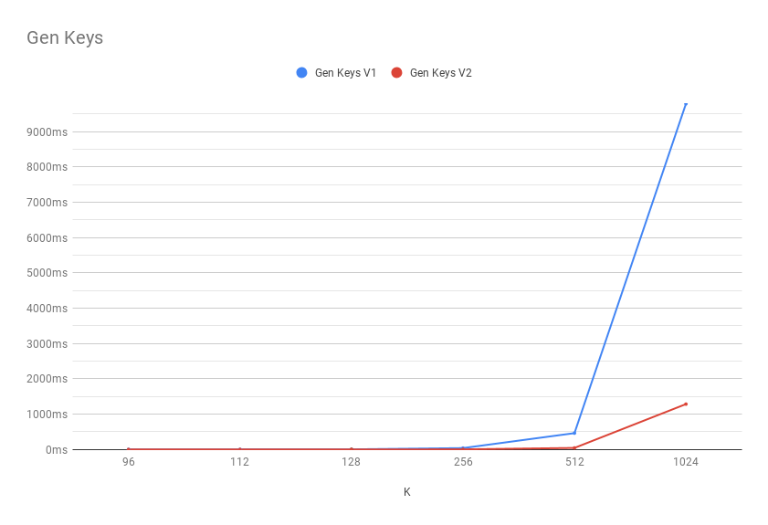

# BHJL13- Efficient Cryptosystems From 2k-th Power Residue Symbols


### Setup

#### Requirements
- `gcc`
- `make`
- `cmake`
- `gmp`
- `pbc`
##### GNU Multi Precision
```shell script
 sudo apt install libgmp-dev
```

##### PBC

Downlaod `pbclib` from [here](https://crypto.stanford.edu/pbc/download.html)
```shell script
sudo apt install flex nettle-dev bison byacc
cd pbc-x.x.x
./configure
make -j9
make install
sudo ldconfig -v
```


### Build
```shell script
mkdir build
cd build
cmake ..
make -j9
```

### Run

#### Tests
```shell script
cd build
./2k-prs-test [...args]
```


#### Main
```shell script
cd build
./2k-prs [args]
```
### Clean

```shell script
rm -rf build/
```


## Benchmarks


| K    | Key Gen V1     | Key Gen V2      | Enc         | Dec V1        | Dec V2        |
|------|----------------|-----------------|-------------|---------------|---------------|
| 96   | 2.123119 ms    | 0.369215 ms     | 0.011639 ms | 0.118156 ms   | 0.108585 ms   |
| 112  | 3.193035 ms    | 0.604870 ms     | 0.017313 ms | 0.220909 ms   | 0.203264 ms   |
| 128  | 4.643717 ms    | 0.693977 ms     | 0.024098 ms | 0.293341 ms   | 0.270914 ms   |
| 256  | 39.979778 ms   | 4.368201 ms     | 0.174665 ms | 2.959049 ms   | 2.934866 ms   |
| 512  | 463.067197 ms  | 44.546143 ms    | 1.160128 ms | 37.920488 ms  | 37.281197 ms  |
| 1024 | 9788.479171 ms | 1285.137385 ms  | 8.734798 ms | 701.867956 ms | 692.339592 ms |




K = 96
```
keys v1: 2.123119 ms (±0.853288 ms)
keys v2: 0.369215 ms (±0.114902 ms)
enc: 0.011639 ms (±0.000085 ms)
dec1': 0.118156 ms (±0.001475 ms)
dec2: 0.108585 ms (±0.000271 ms)
```

K = 112

```
keys v1: 3.193035 ms (±1.189788 ms)
keys v2: 0.604870 ms (±0.176100 ms)
enc: 0.017313 ms (±0.000104 ms)
dec1': 0.220909 ms (±0.002094 ms)
dec2: 0.203264 ms (±0.002212 ms)
```

K = 128
```
keys v1: 4.643717 ms (±1.959309 ms)
keys v2: 0.693977 ms (±0.249302 ms)
enc: 0.024098 ms (±0.000093 ms)
dec1': 0.293341 ms (±0.000940 ms)
dec2: 0.270914 ms (±0.011279 ms)
```

K = 256
```
keys v1: 39.979778 ms (±25.829266 ms)
keys v2: 4.368201 ms (±2.042561 ms)
enc: 0.174665 ms (±0.000566 ms)
dec1': 2.959049 ms (±0.047946 ms)
dec2: 2.934866 ms (±0.028332 ms)
```

K = 512
```
keys v1: 463.067197 ms (±264.881395 ms)
keys v2: 44.546143 ms (±22.930795 ms)
enc: 1.160128 ms (±0.028092 ms)
dec1': 37.920488 ms (±0.623154 ms)
dec2: 37.281197 ms (±0.444532 ms)
```

K = 1024
```
keys v1: 9788.479171 ms
keys v2: 1285.137385 ms (±822.341404 ms)
enc: 8.734798 ms (±1.057663 ms)
dec1': 701.867956 ms (±258.387656 ms)
dec2: 692.339592 ms (±234.939501 ms)
```